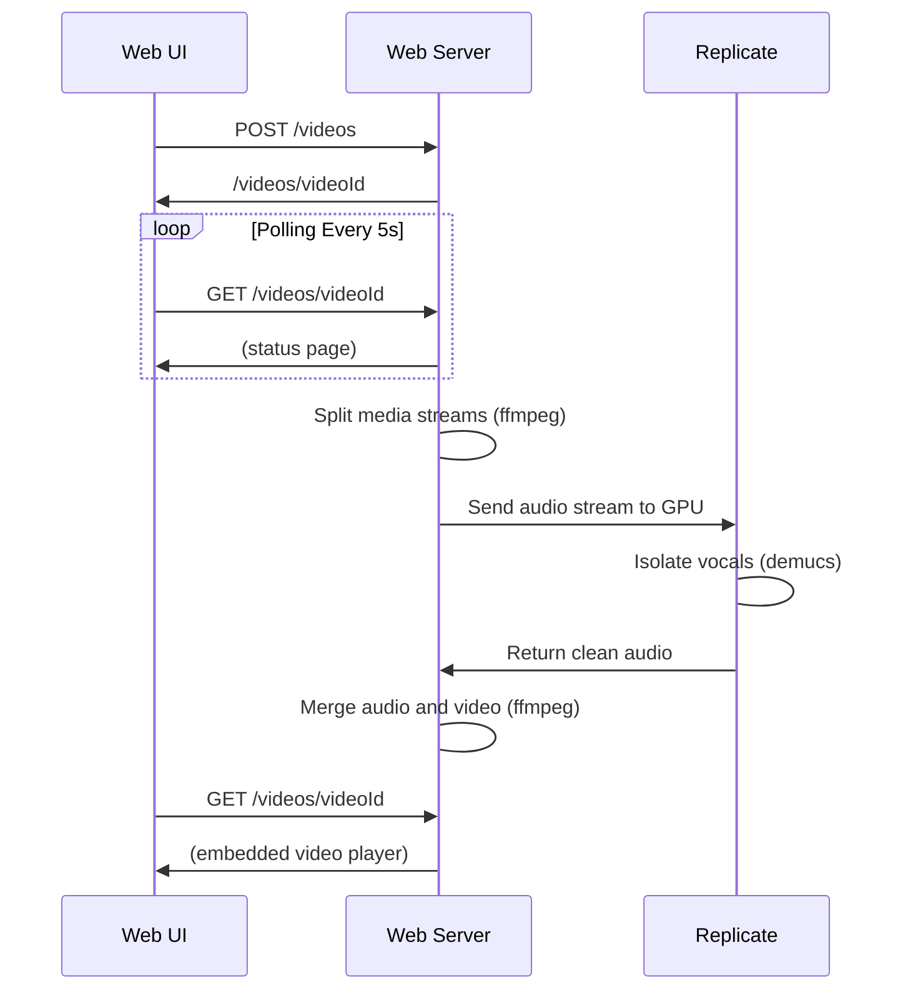

# Demusicator

A web app that automatically removes background music from uploaded videos while preserving speech/vocals using Demucs running on Runpod.io's cloud infrastructure.

## Overview

## Technologies Used

- Python 3.13+
- [Replicate.com](https://replicate.com)
- [Demucs AI STEM audio separator](https://github.com/facebookresearch/demucs)

## Installation

TODO: NEEDS TO BE REWRITTEN

## Project Structure

TODO: NEEDS TO BE REWRITTEN

## Processing Sequence

## Setup in Replicate AI

TODO: NEEDS TO BE REWRITTEN

## Usage

TODO: NEEDS TO BE REWRITTEN

## Processing Steps

TODO: NEEDS TO BE REWRITTEN

## TODO

- Currently, script works with a single video file. It needs to accept upload of a video folder
- It would be nice to implement yt-dlp instead of video uploads, but bot detection / cookie management is still a problem.
