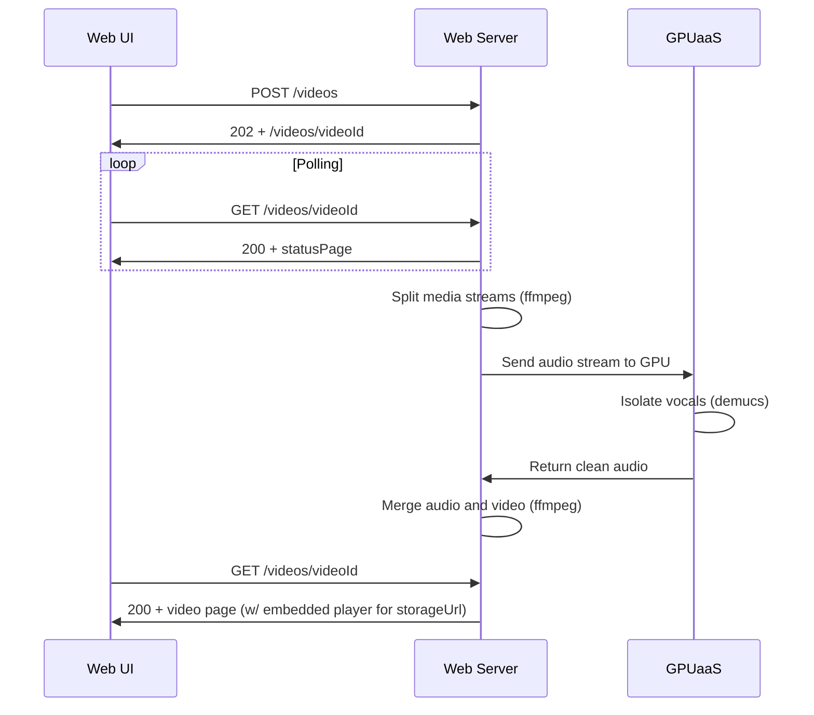

# Demusicator


A web app that automatically removes background music from uploaded videos while preserving speech/vocals using Demucs running on Runpod.io's cloud infrastructure.

## Overview

This project consists of several Python scripts that work together to:

1. Download videos
2. Process them using Demucs to separate vocals from background music
3. Create a new video with only the vocals/speech track

## Technologies Used

- Python 3.11+
- [Runpod.io](https://runpod.io) account
- [Demucs AI STEM audio separator](https://github.com/facebookresearch/demucs)
- [Demucs container from Replicate registry](https://replicate.com/ryan5453/demucs)

TODO: NEEDS TO BE REWRITTEN

## Installation

1. Clone the repository:

```bash
git clone https://github.com/highwatersdev/demusifier.git
cd demusifier
```

2. Create and activate a virtual environment:

```bash
python -m venv .venv
source .venv/bin/activate  # On macOS/Linux
```

3. Install dependencies:

```bash
pip install -r requirements.txt
```

4. Create a `.env` file in the project root:

```shell
VOLUME_DIR="/data"
LOG_LEVEL="INFO"
CONSOLE_LOGGING="True"
RUNPOD_ENDPOINT="https://api.runpod.ai/v2/123/run"
RUNPOD_API_KEY="rpa_FAKEFAKEFAKERC18ox4v"
```

## Project Structure

```shell
demusifier/
├── light_it.py          # Main script for Lightning AI integration
├── demusic.py        # Video processing script
├── cleanup_dirs.py      # Directory cleanup script
├── videos/
│   ├── input/          # Downloaded videos
│   └── output/         # Processed videos
└── .env                # Environment variables
```

## Processing Sequence



## Setup in Lightning AI

1. Create a Runpod.io account at [runpod.io](https://runpod.io)
2. Create an API key:
   - Go to Settings -> API Keys
   - Generate a new key
   - Copy it to your `.env` file

## Usage

TODO: NEEDS TO BE REWRITTEN

## Processing Steps

TODO: NEEDS TO BE REWRITTEN

## TODO

- Currently, script works with a single video file. It needs to accept upload of a video folder
- It would be nice to implement yt-dlp but bot detection / cookie management is still a problem
